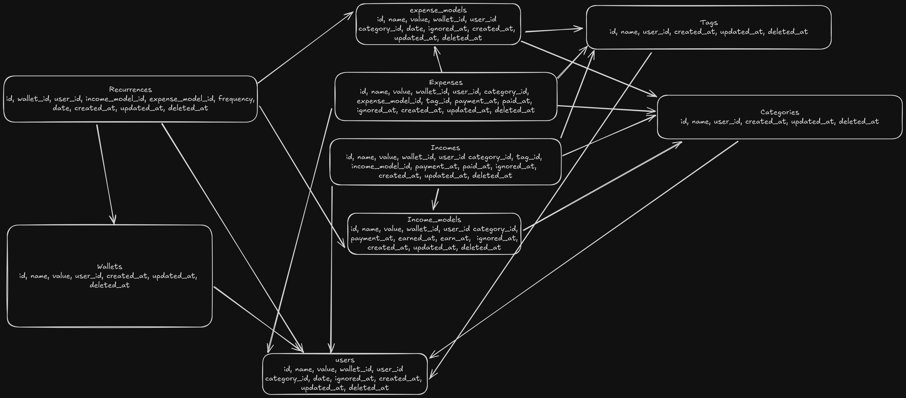

# A personal finance

This is a personal finance project that I am working on. The goal is to create a simple and easy to use personal finance tool that can help me track my expenses and income.

## Objective

The principle reason for this project is to help me track my expenses and income. I want to be able to see how much I am spending and how much I am earning. I also want to be able to see how much I have spent and how much I have earned in a given month or year.

## Why not use an existing tool?

I have tried using existing tools, but do not provide the information that I need.

### Why not use a spreadsheet?

The next step is to create a finance tool that can help me understanding my BTC allocations, it is not possible to do this with a spreadsheet.

## Initial features

- Create expenses
  - Enable recurrence
  - Enable repeat
    - Month, weakly, daily
  - Choose the payment day
  - pay
  - Categories
  - Tags
  - Notes
  - Ignore expense
- Create income
  - Choose the earn day
  - Pay
  - Categories
  - Enable recurrence
  - Enable repeat
    - Month, weakly, daily
  - Notes
  - Ignore income
- View earned month/year
- View earns month/year
- View transactions month/year
- View balance actual
- View balance month/year
- View forecast of balance month/year

### Entities

